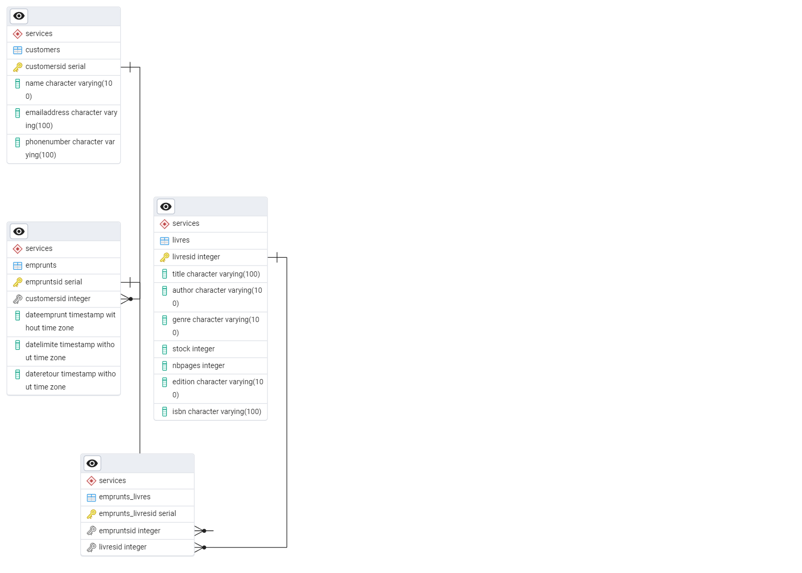
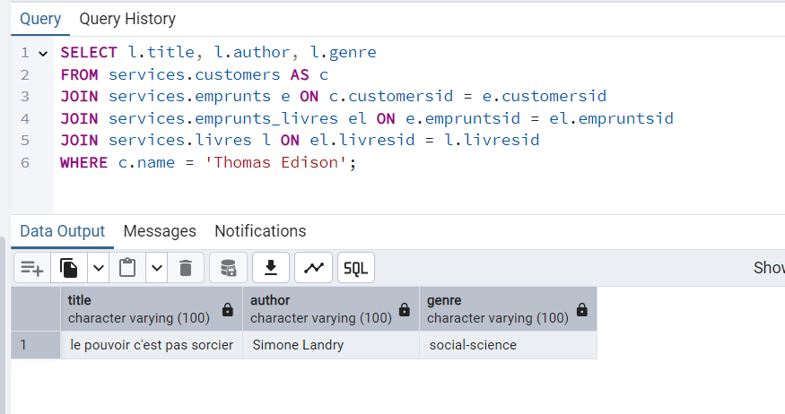
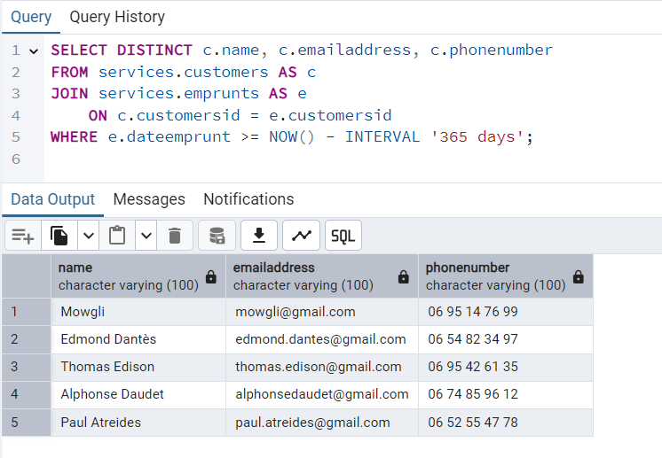

# SQL_DB_gestion_Bibliotheque
Un projet de base de donnée pour une bibliothèque, plus particulièrement la gestion des emprunts de livres

Il y a **4 tables** :
- **customers**          :  Contient la liste des clients et leurs coordonnées et leur ID (PRIMARY KEY)
- **emprunts**           :  Contient un ID d'emprunt (PRIMARY KEY), l'ID d'un utilisateur (FOREIGN KEY) ainsi que la date d'emprunt, la date limite et la date réel de rendu
- **emprunts_livre**     :  Table intermédiaire (associative) qui contient l'ID de l'emprunt de livre (PRIMARY KEY), mais aussi l'ID de l'emprunt (FOREIGN KEY) et l'ID du livre (FOREIGN KEY)
- **livres**             :  Contient l'ID du livre (PRIMARY KEY), le titre, l'auteur, le genre, le stock, le nombre de page, l'édition et le code ISBN

  

2 exemples d'utilisation :

Liste des livres empruntés par Thomas Edison

Liste des clients qui ont empruntés des livres dans les 365 derniers jours

